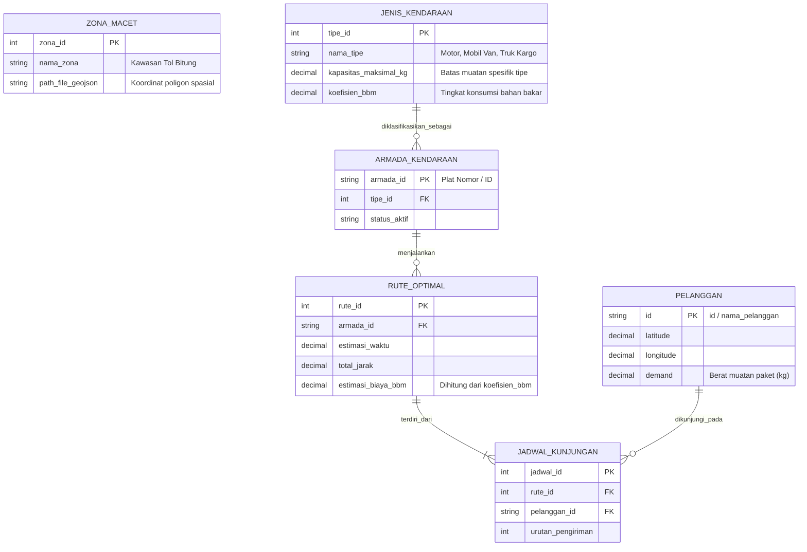
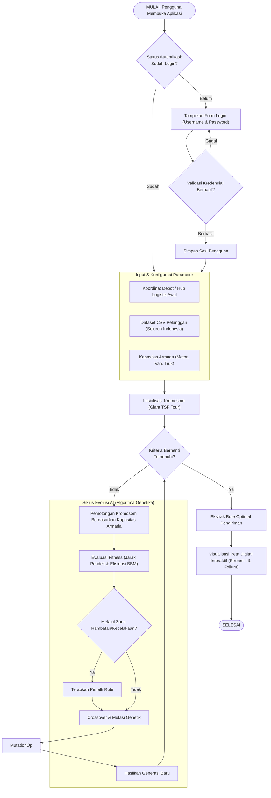
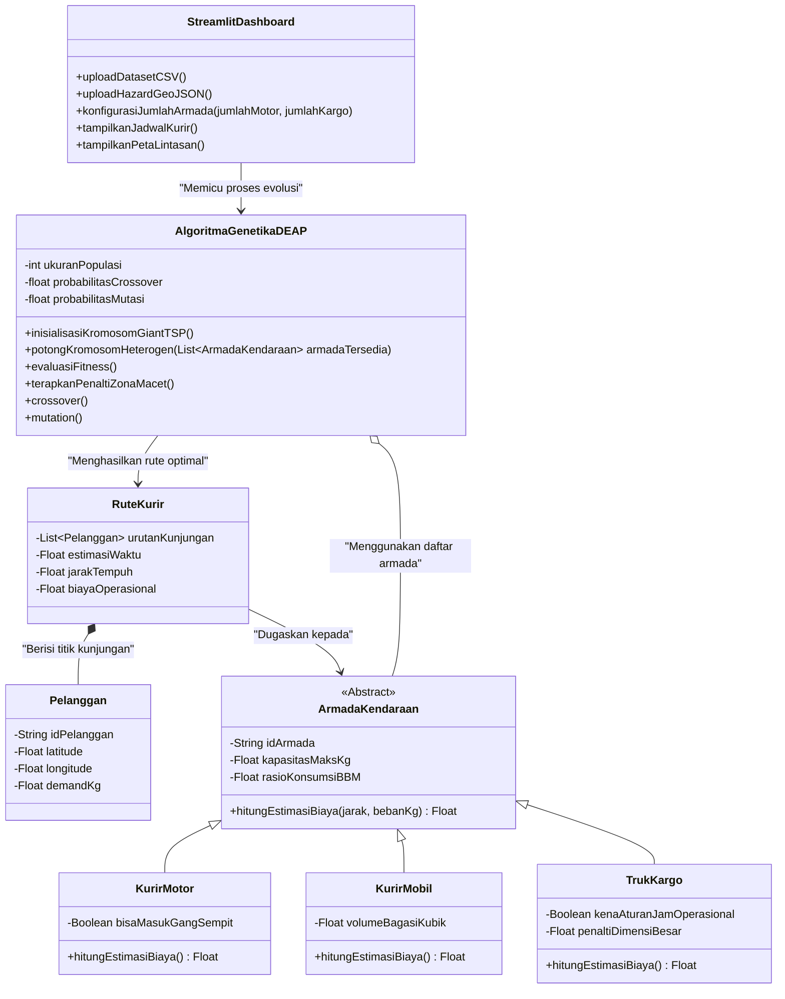
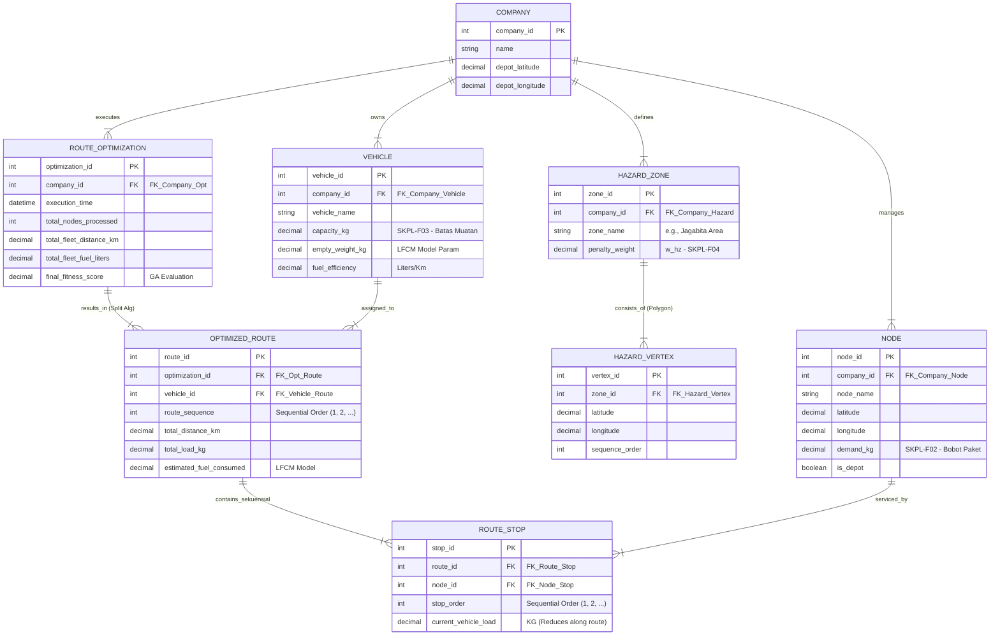

# ERD

```mermaid
erDiagram
    %% --- Dataset Input (Berdasarkan CSV & GeoJSON) ---
    PELANGGAN {
        string id PK "id / nama_pelanggan"
        decimal latitude
        decimal longitude
        decimal demand "Berat muatan paket (kg)"
    }

    ZONA_MACET {
        int zona_id PK
        string nama_zona "Kawasan Tol Bitung"
        string path_file_geojson "Koordinat poligon spasial"
    }

    %% --- Master Data Armada (Baru) ---
    JENIS_KENDARAAN {
        int tipe_id PK
        string nama_tipe "Motor, Mobil Van, Truk Kargo"
        decimal kapasitas_maksimal_kg "Batas muatan spesifik tipe"
        decimal koefisien_bbm "Tingkat konsumsi bahan bakar"
    }

    ARMADA_KENDARAAN {
        string armada_id PK "Plat Nomor / ID"
        int tipe_id FK
        string status_aktif
    }

    %% --- Output Optimasi ---
    RUTE_OPTIMAL {
        int rute_id PK
        string armada_id FK
        decimal estimasi_waktu 
        decimal total_jarak 
        decimal estimasi_biaya_bbm "Dihitung dari koefisien_bbm"
    }

    JADWAL_KUNJUNGAN {
        int jadwal_id PK
        int rute_id FK
        string pelanggan_id FK
        int urutan_pengiriman
    }

    %% --- Relasi ---
    JENIS_KENDARAAN ||--o{ ARMADA_KENDARAAN : "diklasifikasikan_sebagai"
    ARMADA_KENDARAAN ||--o{ RUTE_OPTIMAL : "menjalankan"
    RUTE_OPTIMAL ||--|{ JADWAL_KUNJUNGAN : "terdiri_dari"
    PELANGGAN ||--o{ JADWAL_KUNJUNGAN : "dikunjungi_pada"
```

# FLOW SISTEM

```mermaid
graph TD
    Start(["MULAI: Pengguna Membuka Aplikasi"]) --> CheckLogin{"Status Autentikasi:<br/>Sudah Login?"}
    
    CheckLogin -- Belum --> LoginScreen["Tampilkan Form Login (Username & Password)"]
    LoginScreen --> AuthVerify{"Validasi Kredensial Berhasil?"}
    AuthVerify -- Gagal --> LoginScreen
    AuthVerify -- Berhasil --> SetSession["Simpan Sesi Pengguna"]
    
    CheckLogin -- Sudah --> Input_Data
    SetSession --> Input_Data["Input Data Fleksibel (CSV Pelanggan & GeoJSON Zona Wilayah Indonesia)"]

    subgraph Input_Data ["Input & Konfigurasi Parameter"]
        InputDepot["Koordinat Depot / Hub Logistik Awal"]
        InputDest["Dataset CSV Pelanggan (Seluruh Indonesia)"]
        InputVehCap["Kapasitas Armada (Motor, Van, Truk)"]
    end

    Input_Data --> InitPop["Inisialisasi Kromosom (Giant TSP Tour)"]
    InitPop --> GenLimit{"Kriteria Berhenti<br/>Terpenuhi?"}
    
    subgraph GA_Loop ["Siklus Evolusi AI (Algoritma Genetika)"]
        SplitAlg["Pemotongan Kromosom Berdasarkan Kapasitas Armada"]
        EvalFitness["Evaluasi Fitness (Jarak Pendek & Efisiensi BBM)"]
        CheckHazard{"Melalui Zona Hambatan/Kecelakaan?"}
        AddPenaltyH["Terapkan Penalti Rute"]
        CrossoverOp["Crossover & Mutasi Genetik"]
        CreateOffspring["Hasilkan Generasi Baru"]
    end

    GenLimit -- Tidak --> SplitAlg
    SplitAlg --> EvalFitness
    EvalFitness --> CheckHazard
    CheckHazard -- Ya --> AddPenaltyH
    AddPenaltyH --> CrossoverOp
    CheckHazard -- Tidak --> CrossoverOp
    CrossoverOp --> MutationOp
    MutationOp --> CreateOffspring
    CreateOffspring --> GenLimit
    
    GenLimit -- Ya --> GetBestR["Ekstrak Rute Optimal Pengiriman"]
    GetBestR --> RenderMap["Visualisasi Peta Digital Interaktif (Streamlit & Folium)"]
    RenderMap --> End(["SELESAI"])
```

# UML

```mermaid
classDiagram
    %% --- Boundary (Antarmuka Pengguna) ---
    class StreamlitDashboard {
        +uploadDatasetCSV()
        +uploadHazardGeoJSON()
        +konfigurasiJumlahArmada(jumlahMotor, jumlahKargo)
        +tampilkanJadwalKurir()
        +tampilkanPetaLintasan()
    }

    %% --- Controllers (Logika Utama & Pustaka) ---
    class AlgoritmaGenetikaDEAP {
        -int ukuranPopulasi
        -float probabilitasCrossover
        -float probabilitasMutasi
        +inisialisasiKromosomGiantTSP()
        +potongKromosomHeterogen(List~ArmadaKendaraan~ armadaTersedia)
        +evaluasiFitness()
        +terapkanPenaltiZonaMacet()
        +crossover()
        +mutation()
    }

    %% --- Entities (Struktur Data & Inheritance Armada) ---
    class Pelanggan {
        -String idPelanggan
        -Float latitude
        -Float longitude
        -Float demandKg
    }

    class RuteKurir {
        -List~Pelanggan~ urutanKunjungan
        -Float estimasiWaktu
        -Float jarakTempuh
        -Float biayaOperasional
    }

    class ArmadaKendaraan {
        <<Abstract>>
        -String idArmada
        -Float kapasitasMaksKg
        -Float rasioKonsumsiBBM
        +hitungEstimasiBiaya(jarak, bebanKg) Float
    }

    class KurirMotor {
        -Boolean bisaMasukGangSempit
        +hitungEstimasiBiaya() Float
    }

    class KurirMobil {
        -Float volumeBagasiKubik
        +hitungEstimasiBiaya() Float
    }

    class TrukKargo {
        -Boolean kenaAturanJamOperasional
        -Float penaltiDimensiBesar
        +hitungEstimasiBiaya() Float
    }

    %% --- Relasi ---
    StreamlitDashboard --> AlgoritmaGenetikaDEAP : "Memicu proses evolusi"
    
    AlgoritmaGenetikaDEAP --> RuteKurir : "Menghasilkan rute optimal"
    AlgoritmaGenetikaDEAP o-- ArmadaKendaraan : "Menggunakan daftar armada"
    
    RuteKurir *-- Pelanggan : "Berisi titik kunjungan"
    RuteKurir --> ArmadaKendaraan : "Dugaskan kepada"
    
    %% Relasi Pewarisan (Inheritance)
    ArmadaKendaraan <|-- KurirMotor
    ArmadaKendaraan <|-- KurirMobil
    ArmadaKendaraan <|-- TrukKargo
```

# SKEMA BASIS DATA

```mermaid
erDiagram
    %% --- Entities ---

    %% Data Induk / Konfigurasi
    COMPANY {
        int company_id PK
        string name
        decimal depot_latitude
        decimal depot_longitude
    }

    VEHICLE {
        int vehicle_id PK
        int company_id FK "FK_Company_Vehicle"
        string vehicle_name
        decimal capacity_kg "SKPL-F03 - Batas Muatan"
        decimal empty_weight_kg "LFCM Model Param"
        decimal fuel_efficiency "Liters/Km"
    }

    NODE {
        int node_id PK
        int company_id FK "FK_Company_Node"
        string node_name
        decimal latitude
        decimal longitude
        decimal demand_kg "SKPL-F02 - Bobot Paket"
        boolean is_depot
    }

    HAZARD_ZONE {
        int zone_id PK
        int company_id FK "FK_Company_Hazard"
        string zone_name "e.g., Jagabita Area"
        decimal penalty_weight "w_hz - SKPL-F04"
    }

    %% Sub-table for polygon vertices (Folium GeoJSON map data)
    HAZARD_VERTEX {
        int vertex_id PK
        int zone_id FK "FK_Hazard_Vertex"
        decimal latitude
        decimal longitude
        int sequence_order
    }

    %% Data Transaksional / Hasil Optimasi
    ROUTE_OPTIMIZATION {
        int optimization_id PK
        int company_id FK "FK_Company_Opt"
        datetime execution_time
        int total_nodes_processed
        decimal total_fleet_distance_km
        decimal total_fleet_fuel_liters
        decimal final_fitness_score "GA Evaluation"
    }

    %% Individual routes within a single optimization (from Split Algorithm)
    OPTIMIZED_ROUTE {
        int route_id PK
        int optimization_id FK "FK_Opt_Route"
        int vehicle_id FK "FK_Vehicle_Route"
        int route_sequence "Sequential Order (1, 2, ...)"
        decimal total_distance_km
        decimal total_load_kg
        decimal estimated_fuel_consumed "LFCM Model"
    }

    %% Order of nodes within a specific optimized route (Polyline Folium)
    ROUTE_STOP {
        int stop_id PK
        int route_id FK "FK_Route_Stop"
        int node_id FK "FK_Node_Stop"
        int stop_order "Sequential Order (1, 2, ...)"
        decimal current_vehicle_load "KG (Reduces along route)"
    }

    %% --- Relationships ---
    COMPANY ||--|{ VEHICLE : "owns"
    COMPANY ||--|{ NODE : "manages"
    COMPANY ||--|{ HAZARD_ZONE : "defines"
    COMPANY ||--|{ ROUTE_OPTIMIZATION : "executes"

    HAZARD_ZONE ||--|{ HAZARD_VERTEX : "consists_of (Polygon)"

    ROUTE_OPTIMIZATION ||--|{ OPTIMIZED_ROUTE : "results_in (Split Alg)"
    
    VEHICLE ||--|{ OPTIMIZED_ROUTE : "assigned_to"
    
    OPTIMIZED_ROUTE ||--|{ ROUTE_STOP : "contains_sekuensial"
    NODE ||--|{ ROUTE_STOP : "serviced_by"
```
