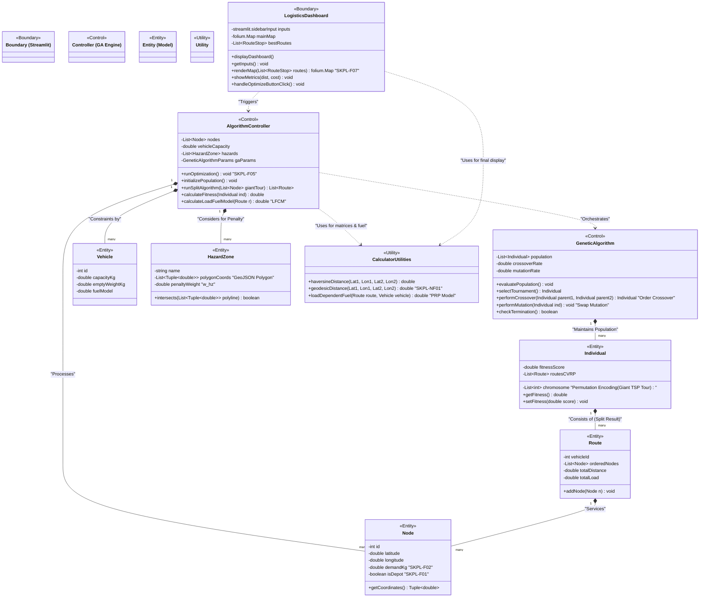

# FLOW SISTEM

```mermaid
graph TD
    %% --- Start/End Nodes ---
    Start([MULAI: Pengguna Membuka Aplikasi Streamlit])
    End([SELESAI: Rute Ditampilkan di Dasbor])

    %% --- Input/Output Sections ---
    subgraph Input_Data [Fase 1: Analisis & Input (SKPL-F01, F02, F03, F04)]
        InputDepot[<center>Input Koordinat Depot Awal<br/>(Lat, Lon)</center>]
        InputDest[<center>Input Daftar Destinasi & Bobot Paket<br/>(CSV/Manual)</center>]
        InputVehCap[<center>Atur Kapasitas Max Kendaraan<br/>(kg)</center>]
        InputHazard[<center>Definisikan Koordinat Poligon<br/>Zona Horor Parung Panjang</center>]
    end

    %% --- Process Section - Pre-Processing ---
    subgraph Pre_Processing [Fase 2: Pra-pemrosesan Data]
        CalcMatrix[<center>Hitung Matriks Jarak Geospasial<br/>(Formula Haversine/Geodesic)</center>]
    end

    %% --- Process Section - Core AI (GA) ---
    subgraph GA_Engine [Fase 3: Mesin Optimasi Genetika (SKPL-F05)]
        InitPop[<center>Inisialisasi Populasi Awal<br/>(Giant TSP Tour - Permutation Encoding)</center>]
        GenLimit{Kriteria Berhenti<br/>Terpenuhi?<br/>(Generasi Max / Konvergen)}
        
        subgraph GA_Loop [Siklus Evolusi]
            %% Split & CVRP handling
            SplitAlg[<center>Jalankan <b>Split Algorithm</b><br/>(Ubah Giant Tour jadi rute CVRP mandiri<br/>berdasarkan Kapasitas Kendaraan)</center>]
            
            %% Fitness Evaluation including Penalties
            EvalFitness[<center>Evaluasi Nilai Kebugaran <b>(Fitness Function)</b></center>]
            CalcFuel[<center>Hitung Estimasi Cost BBM<br/>(Model LFCM - Beban & Jarak)</center>]
            CheckHazard{Garis Rute<br/>Memotong Poligon<br/>Parung Panjang?}
            
            %% Penalty Application
            AddPenaltyQ[<center>Terapkan <b>Penalty Capacity</b><br/>pada Fitness</center>]
            AddPenaltyH[<center>Terapkan <b>Penalty Hazard</b> Ekstrem<br/>pada Fitness</center>]
            
            %% Genetic Operators
            SelectParents[<center>Seleksi Induk<br/>(Tournament Selection)</center>]
            CrossoverOp[<center>Pindah Silang<br/>(Order Crossover / PMX)</center>]
            MutationOp[<center>Mutasi<br/>(Swap Mutation < 5%)</center>]
            CreateOffspring[<center>Bentuk Generasi Baru</center>]
        end
    end

    %% --- Output/Visualization Section ---
    subgraph Output_Vis [Fase 4: Implementasi & Visualisasi (SKPL-F06, F07)]
        GetBestR[<center>Ekstrak Kandidat Rute Optimum Global</center>]
        ExtMetrics[<center>Kalkulasi Metrik Operasional<br/>(Jarak, Waktu, Biaya BBM)</center>]
        RenderMap[<center>Rendering Peta Interaktif <b>Folium</b><br/>(Polyline Rute, Marker Destinasi,<br/>Polygon Overlay Zona Horor)</center>]
        UpdateDash[<center>Update Dasbor <b>Streamlit</b><br/>(Tampilkan Metrik & Peta)</center>]
    end

    %% --- Connectors ---
    Start --> Input_Data
    Input_Data --> CalcMatrix
    CalcMatrix --> InitPop
    InitPop --> GenLimit
    
    %% Loop Logic
    GenLimit -- Tidak --> SplitAlg
    SplitAlg --> EvalFitness
    EvalFitness --> CalcFuel
    CalcFuel --> CheckHazard
    CheckHazard -- Ya --> AddPenaltyH
    AddPenaltyH --> AddPenaltyQ
    CheckHazard -- Tidak --> AddPenaltyQ
    AddPenaltyQ --> SelectParents
    SelectParents --> CrossoverOp
    CrossoverOp --> MutationOp
    MutationOp --> CreateOffspring
    CreateOffspring -- "Generasi Berikutnya" --> GenLimit
    
    %% Termination Logic
    GenLimit -- Ya --> GetBestR
    GetBestR --> ExtMetrics
    ExtMetrics --> RenderMap
    RenderMap --> UpdateDash
    UpdateDash --> End

    %% Styling for clarity
    classDef process fill:#e1f5fe,stroke:#01579b,stroke-width:2px;
    classDef decision fill:#fff9c4,stroke:#fbc02d,stroke-width:2px;
    classDef inputout fill:#e8f5e9,stroke:#2e7d32,stroke-width:2px;
    classDef loopsub fill:#f3e5f5,stroke:#7b1fa2,stroke-width:1px,stroke-dasharray: 5 5;
    classDef startend fill:#ffccbc,stroke:#bf360c,stroke-width:2px,rx:10,ry:10;

    class Start,End startend;
    class InputDepot,InputDest,InputVehCap,InputHazard inputout;
    class CalcMatrix,InitPop,SplitAlg,EvalFitness,CalcFuel,AddPenaltyQ,AddPenaltyH,SelectParents,CrossoverOp,MutationOp,CreateOffspring,GetBestR,ExtMetrics,RenderMap,UpdateDash process;
    class GenLimit,CheckHazard decision;
    class GA_Loop loopsub;
```

# UML



# SKEMA BASIS DATA


